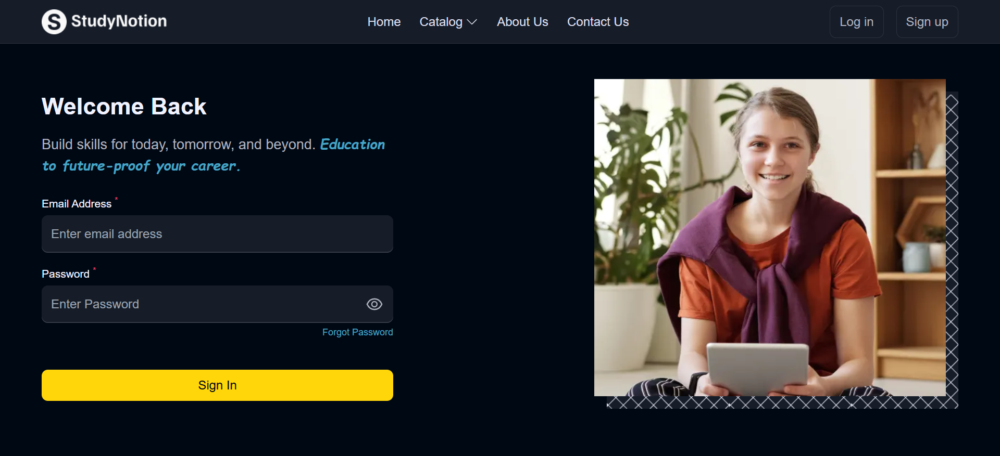
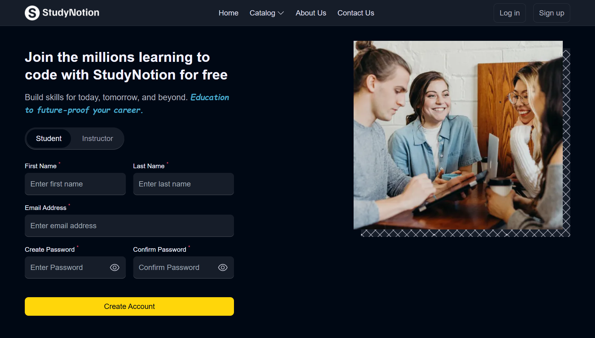
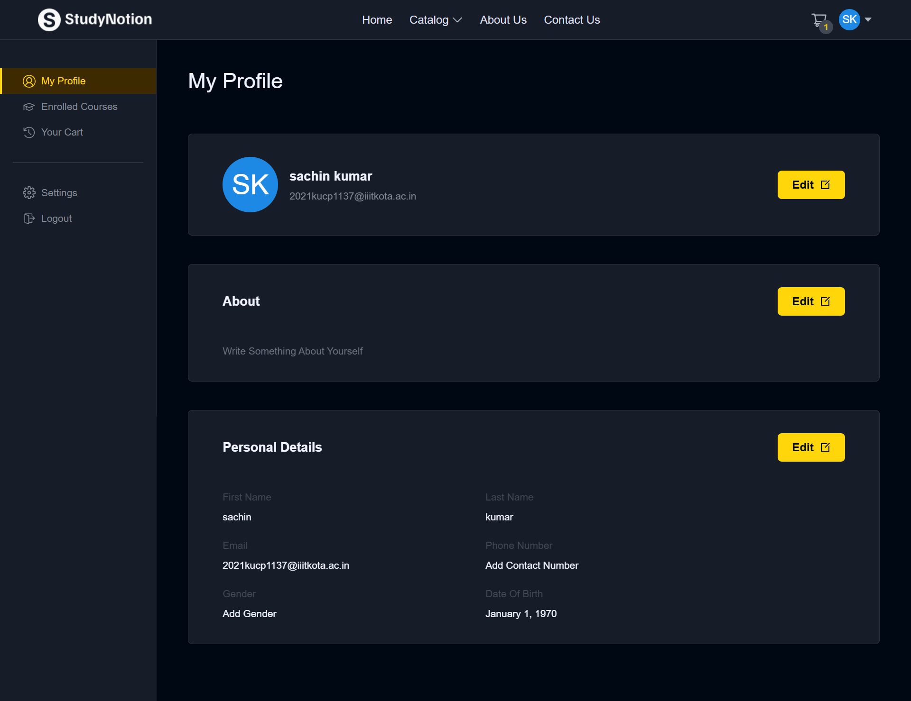
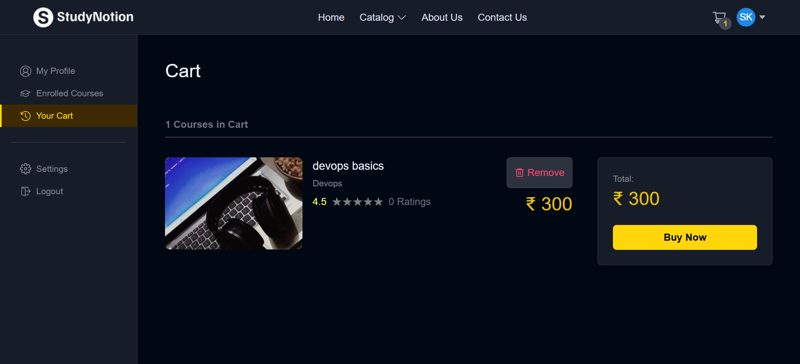
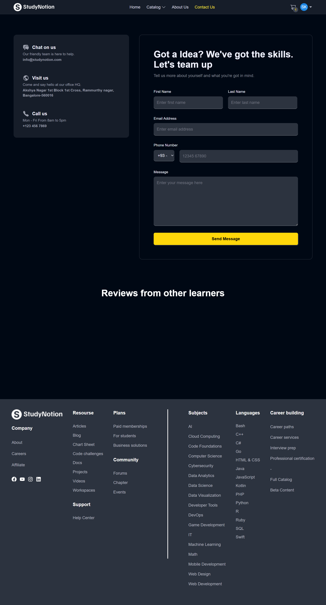
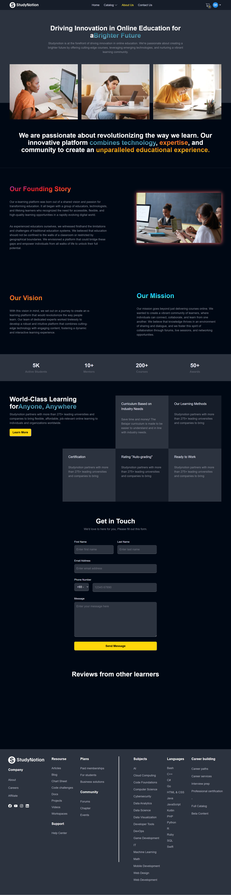
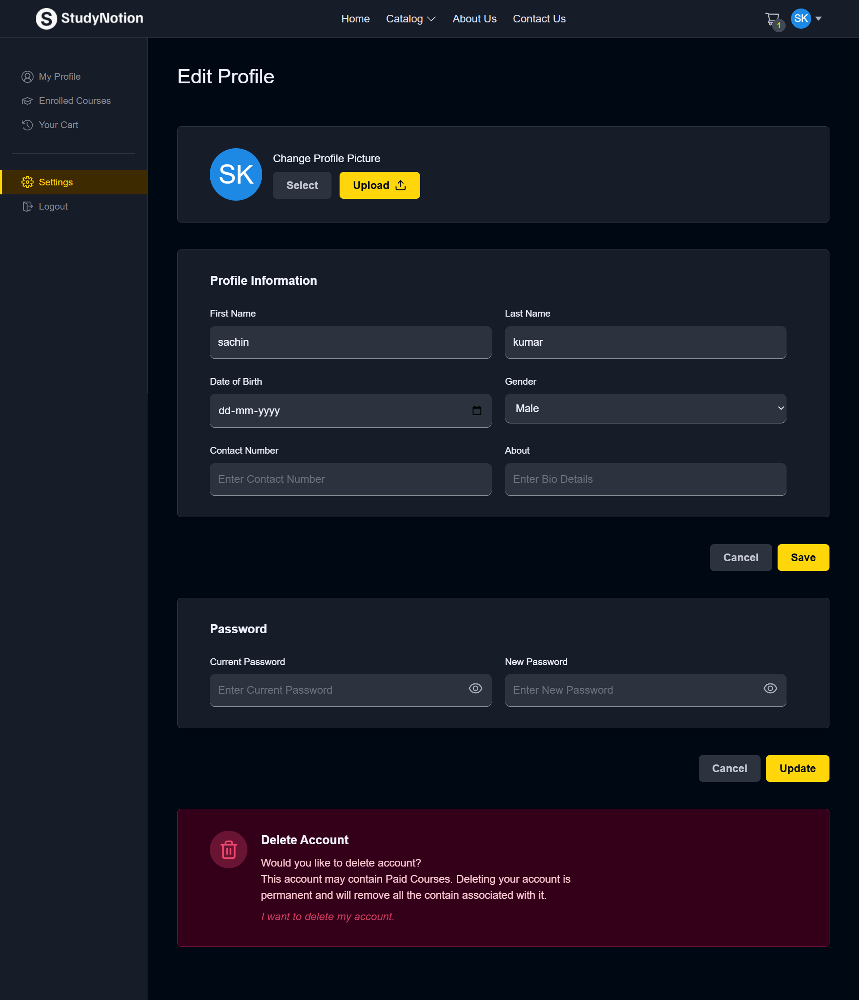

# 📚 StudyNotion – EdTech Platform

StudyNotion is a full-featured EdTech platform that provides a modern and interactive learning experience for students and instructors. It supports course creation, secure payments, progress tracking, and much more.


## 🔗 Live Demo

👉 [Live Site](https://study-notion-app-two.vercel.app/)  
🔐 Use demo credentials or register a new account to explore.



---

## 🚀 Features

- 👨‍🏫 Instructor dashboard for creating and managing courses
- 🎓 Student dashboard with progress tracking and course access
  
- 🧾 User authentication and authorization
- 🔒 Role-based access (Admin, Instructor, Student)
 
- 📹 Rich video content support (via Cloudinary)
- 💳 Secure payment integration (Razorpay )
- 🌐 Fully responsive and mobile-friendly UI
- 📨 Contact and support form
  
- 📈 Analytics & course performance insights

---

## 🛠️ Tech Stack


**Frontend:**
- React.js
- Tailwind CSS
- Redux Toolkit
- React Router
- Axios
- Toastify

**Backend:**
- Node.js
- Express.js
- MongoDB + Mongoose
- Cloudinary (media hosting)
- Razorpay (payments)
- JWT (authentication)
- Nodemailer (email service)

---

## 🧑‍💻 Getting Started

### Prerequisites

- Node.js (v16 or later)
- MongoDB (local or MongoDB Atlas)
- Git
- Cloudinary account
- Razorpay account

### Installation

#### 1. Clone the repository

```bash
git clone https://github.com/shashank2314/StudyNotion-App
